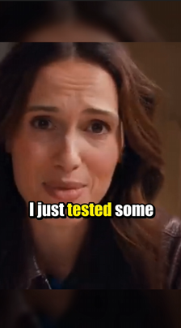
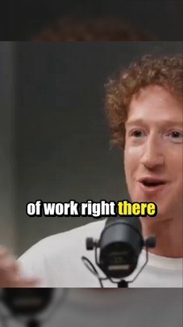

# 🎬 Auto Shorts Generator

[](https://www.python.org/)
[](https://opensource.org/licenses/MIT)
[](https://github.com/yourusername/auto-shorts-generator)

*Read this in other languages: [English](README.md) | [한국어](README.ko.md).*

<p align="center">
  
  
  
</p>

An automated Python tool that takes a long-form video, identifies the most engaging highlights ("hooks"), and automatically edits them into viral short-form videos (TikTok, YouTube Shorts, Instagram Reels).

## ✨ Features

- **Interactive CLI**: Easy-to-use menu-driven command-line interface.
- **Smart Hook Extraction**: Leverages Large Language Models (**Gemini** or **OpenAI**) to analyze transcripts and find the most engaging parts of your video.
- **High-Performance Transcription**: Uses `faster-whisper` for fast and accurate local speech-to-text conversion.
- **Dynamic Face Tracking**: Automatically detects and tracks faces, cropping landscape (16:9) videos into portrait (9:16) format while keeping the subject centered.
- **Bouncing Subtitles**: Generates TikTok-style word-by-word highlighted subtitles with a dynamic bounce effect.
- **Auto Background Blur**: Fills the background with a blurred version of the original video for a premium look.

## 🛠 Prerequisites

1. **Python 3.12** or higher.
2. **FFmpeg**: Must be installed and added to your system's PATH.
3. **GPU (Optional but recommended)**: For faster Whisper transcription and NVENC video encoding (NVIDIA).

## 🤷‍♂️ GPU Issues

**RTX 50XX Series**
Currently, there may be library compatibility issues with NVIDIA RTX 50-series GPUs, which can cause the Whisper transcription speed to be significantly slower than expected. This is a known issue with the underlying libraries and may be resolved in future updates.


## 📦 Installation

This project uses [uv](https://github.com/astral-sh/uv) for lightning-fast Python package management.

0. Install uv:
   ```bash
   pip install uv
   ```

1. Clone this repository:
   ```bash
   git clone https://github.com/yourusername/auto-shorts-generator.git
   cd auto-shorts-generator
   ```

2. Install dependencies (this will automatically create a virtual environment and install packages using `pyproject.toml` / `uv.lock`):
   ```bash
   uv sync
   ```

## 🚀 Quick Start

Run the main script using `uv` to start the interactive CLI:

```bash
uv run main.py
```

### Initial Setup
On your first run, the tool will guide you through an initial setup. You will need to provide:
- **LLM Provider**: Choose between `gemini` or `openai`.
- **API Key**: Your Gemini API Key or OpenAI API Key (depending on your choice).
- **Other Settings**: Output directory, Whisper model size (tiny, base, small, medium, large), subtitle font settings, etc.

*Settings are saved to `settings.json` so you don't have to enter them every time.*

## 📂 Project Structure

- `main.py`: The entry point of the application. Handles the interactive CLI, user settings, and orchestrates the video generation pipeline.
- `extractor.py`: Handles audio extraction from the video, speech-to-text transcription using `faster-whisper`, and hook analysis using the chosen LLM API.
- `video_editor.py`: The core video editing engine using `moviepy` and `OpenCV`. Handles face tracking, 9:16 cropping, background blurring, audio mixing, and generating word-by-word subtitle clips.

## ⚙️ Configuration (settings.json)
You can manually edit `settings.json` or update it via the CLI Menu (Option 2).
- `llm_provider`: "gemini" or "openai"
- `model_size`: Whisper model size (default: "base")
- `max_duration`: Maximum length of the generated short in seconds (default: 60)
- `highlight_color`: Color of the spoken word in subtitles (default: "yellow")


## 📄 License
This project is open-source and available under the MIT License.
